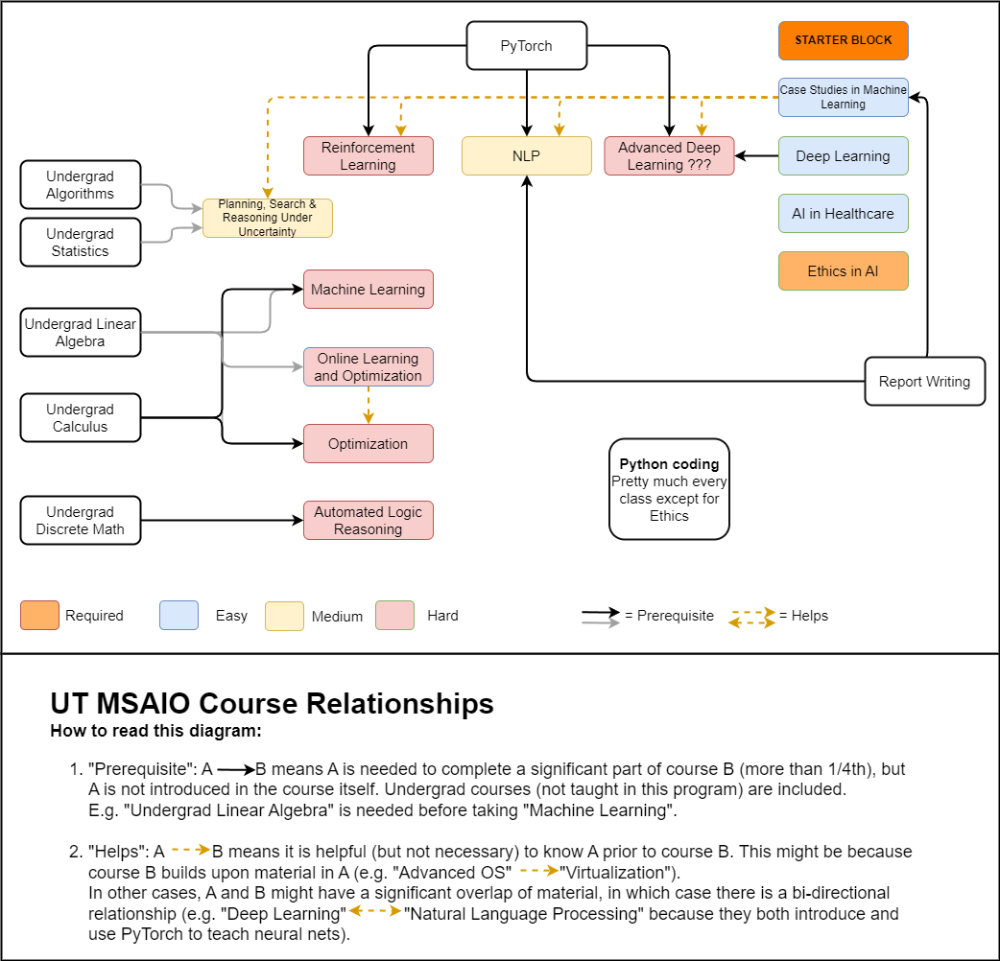

# UT Austin MSAI Course Relationship & Study Plan

This page explains the relationship of each course offered at the **UT Austin MSAI program**.  

Thanks to [Gclabbe](https://github.com/Gclabbe/ut-msaio) for the reference.  
We referred to the information based on the GitHub contents provided here:  
[UT MSAIO Course Relations (Nov 2024)](https://github.com/Gclabbe/ut-msaio/blob/main/overview/UT%20MSAIO%20Course%20Relations%20-%20Nov%202024.drawio.png)

## 📅 Study Plan
### 📊 Difficulty Legend
- 🟦 **Easy**  
- 🟨 **Medium**  
- 🟥 **Hard**

### **Fall 2025**
- ✅ Ethics in AI 🟦 *(Required, no prereqs)*  
👉 Light semester → perfect for your first term while adapting to study + full-time work balance.  

**Cumulative total: 1 course**

### **Spring 2026**
- ✅ AI in Healthcare 🟦  
- ✅ NLP 🟨 *(foundation for Data Science and AI engineer)*  
👉 Builds core + applied skills.  

**Cumulative total: 3 courses**

### **Summer 2026**
- ✅ Deep Learning 🟨  
- ✅ Case Study in Machine Learning 🟦  

**Cumulative total: 5 courses**

### **Fall 2026**
- ✅ Advanced Deep Learning 🟥  

**Cumulative total: 6 courses**

### **Spring 2027**
- ✅ Reinforcement Learning 🟥  
- ✅ Machine Learning 🟨  

**Cumulative total: 8 courses**

### **Summer 2027**
- ✅ Planning, Search & Reasoning Under Uncertainty 🟨  

**Cumulative total: 9 courses**

### **Fall 2027**
- ✅ Online Learning and Optimization 🟥  

**Cumulative total: 10 courses 🎓**
